# Summit KT Portal — Architecture

> **Version:** 1.1.0  
> **Stack:** Next.js 16 · PostgreSQL 13+ · NextAuth.js v4 · Local Storage / Cloudflare R2 · Groq · @xenova/transformers · SendGrid · Tailwind CSS  
> **Purpose:** Enterprise knowledge-transfer portal for structured team transitions

> **May 2026 Addendum:** Document threads, open-thread triage queues, chunk full-text search, interactive study mode, flashcards with spaced repetition, and quiz attempt history retention are now part of the production architecture.

---

## Table of Contents

1. [System Overview](#1-system-overview)
2. [High-Level Architecture](#2-high-level-architecture)
3. [Application Layer Structure](#3-application-layer-structure)
4. [Data Architecture](#4-data-architecture)
5. [Authentication & Authorization Flow](#5-authentication--authorization-flow)
6. [Document Ingestion Pipeline](#6-document-ingestion-pipeline)
7. [RAG AI Chat Pipeline](#7-rag-ai-chat-pipeline)
8. [Quiz Generation & Delivery Flow](#8-quiz-generation--delivery-flow)
9. [Background Job Queue](#9-background-job-queue)
10. [Role-Based Access Control Model](#10-role-based-access-control-model)
11. [API Surface](#11-api-surface)
12. [Component Hierarchy](#12-component-hierarchy)
13. [Security Model](#13-security-model)
14. [Deployment Topology](#14-deployment-topology)

---

## 1. System Overview

Summit KT Portal is a **multi-role, multi-project knowledge-transfer platform**. It enables organisations to manage the entire KT lifecycle:

- Admins **publish** KT documents and configure readiness quizzes
- Members **read** documents, **converse** with an AI assistant grounded in those documents, and **complete** structured readiness assessments
- Project Admins **manage** their assigned project without gaining broader system privileges

```
┌──────────────────────────────────────────────────────────────────┐
│                        SUMMIT KT PORTAL                          │
│                                                                  │
│  SUPER ADMIN           PROJECT ADMIN          MEMBER             │
│  ───────────           ─────────────          ──────             │
│  Create & manage       Manage assigned        View assigned      │
│  all projects          project only           projects           │
│                                                                  │
│  Upload & process      Upload docs            Chat with AI       │
│  KT documents          Invite members         assistant          │
│                                                                  │
│  Generate AI quizzes   Manage quiz            Take readiness     │
│                        sets                   quiz               │
│                                                                  │
│  View analytics &      View project           Bookmark AI        │
│  activity (all)        members                answers            │
│                                                                  │
│  Manage all users      Approve/reject         Request quiz       │
│                        retake requests        re-enable          │
└──────────────────────────────────────────────────────────────────┘
```

---

## 2. High-Level Architecture

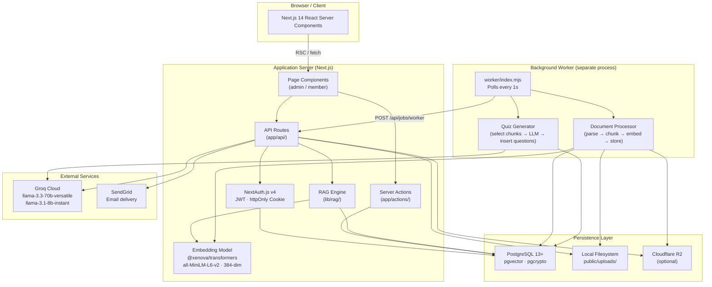

---

## 3. Application Layer Structure

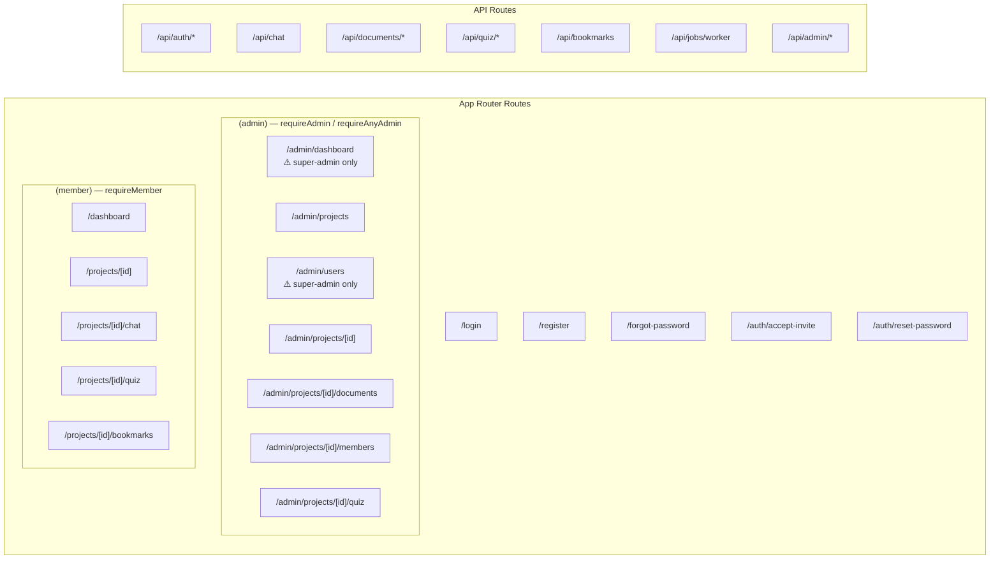

---

## 4. Data Architecture

### 4.1 Entity Relationship Diagram

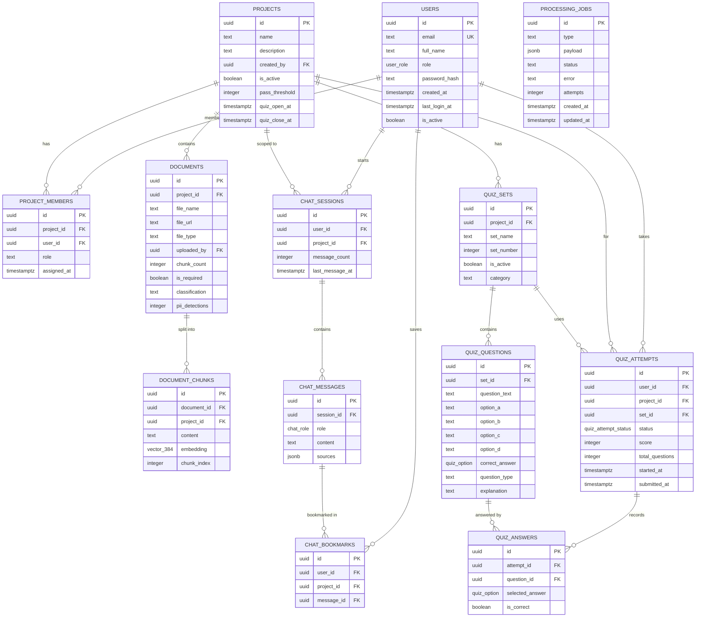

### 4.2 Key Indexes

| Table             | Index                                         | Purpose                                |
| ----------------- | --------------------------------------------- | -------------------------------------- |
| `document_chunks` | `USING ivfflat (embedding vector_cosine_ops)` | Fast ANN cosine similarity search      |
| `document_chunks` | `(project_id)`                                | Filter chunks by project               |
| `quiz_attempts`   | `(user_id, project_id)`                       | Look up a member's attempt per project |
| `project_members` | `(project_id, role)`                          | Filter project admins efficiently      |
| `processing_jobs` | `(status, created_at)`                        | Worker job queue polling               |

---

## 5. Authentication & Authorization Flow

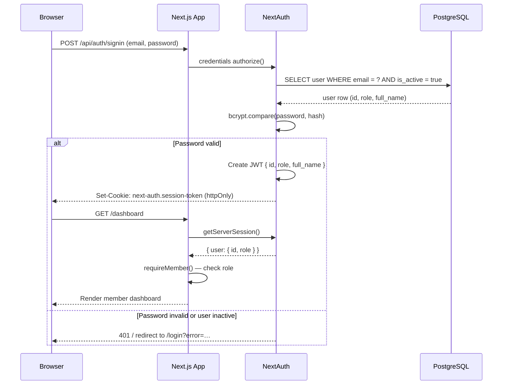

### Route Guards

| Guard function                   | Where used                                      | Logic                                                                   |
| -------------------------------- | ----------------------------------------------- | ----------------------------------------------------------------------- |
| `requireMember()`                | All member pages                                | Session exists + any role                                               |
| `requireAdmin()`                 | Super-admin pages (dashboard, users, analytics) | `role === 'admin'`                                                      |
| `requireAnyAdmin()`              | Admin layout                                    | `role === 'admin'` OR is a project admin of any project                 |
| `requireProjectAdmin(projectId)` | Project detail/members/quiz pages               | `role === 'admin'` OR `project_members.role = 'admin'` for that project |

---

## 6. Document Ingestion Pipeline

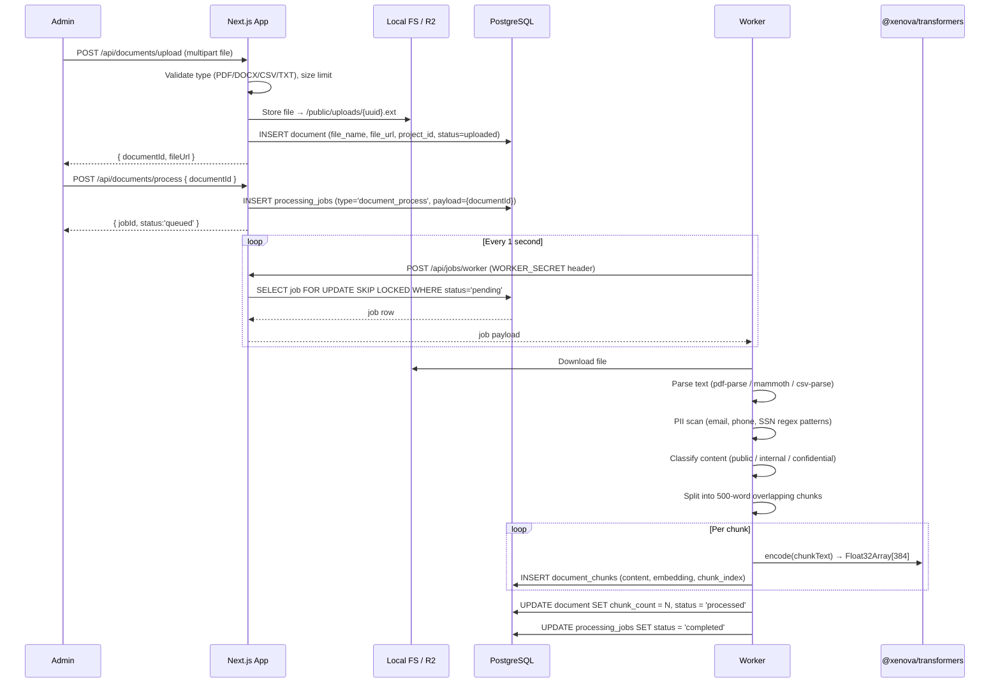

---

## 7. RAG AI Chat Pipeline

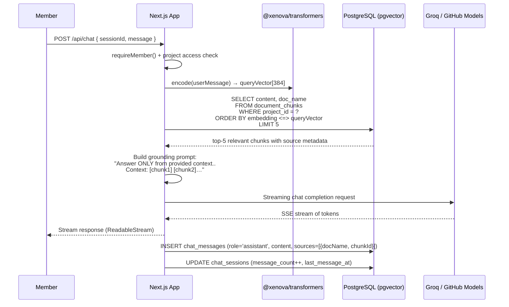

---

## 8. Quiz Generation & Delivery Flow

### Generation

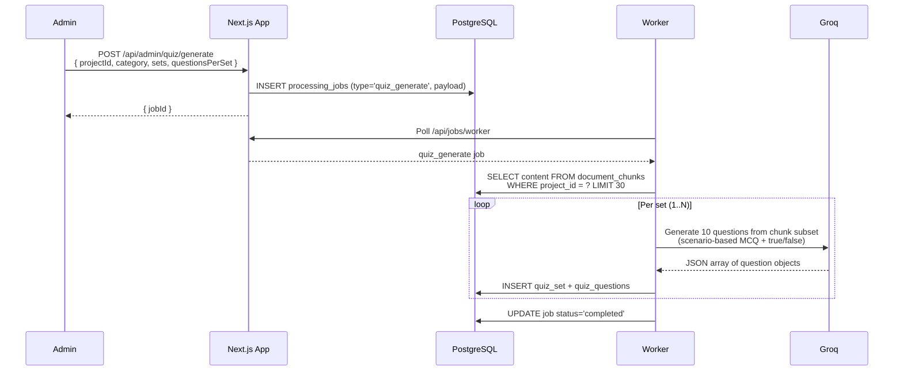

### Delivery

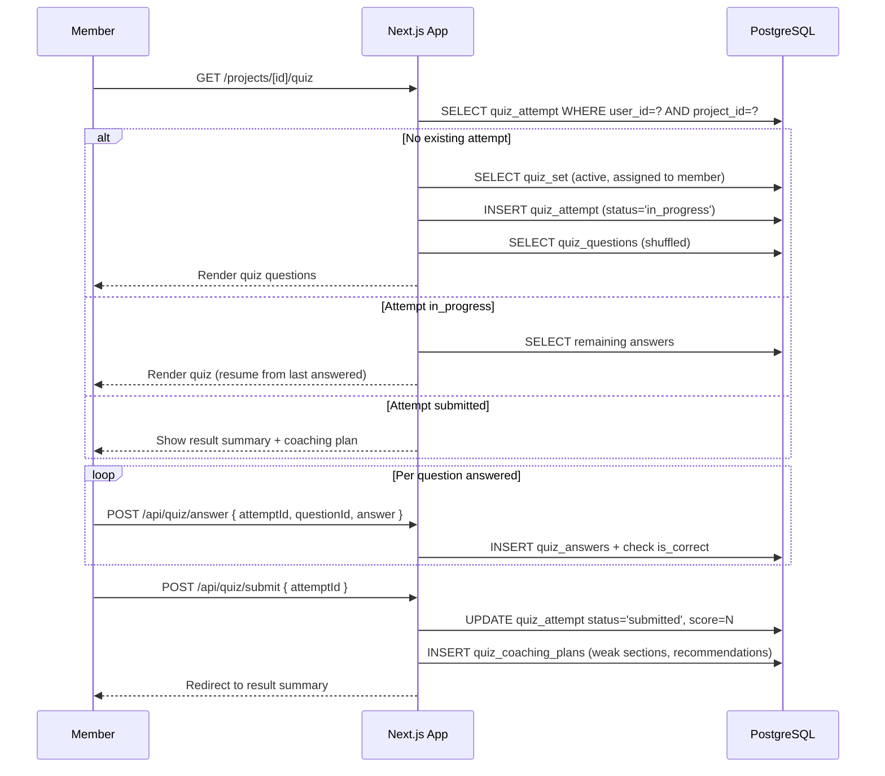

---

## 9. Background Job Queue

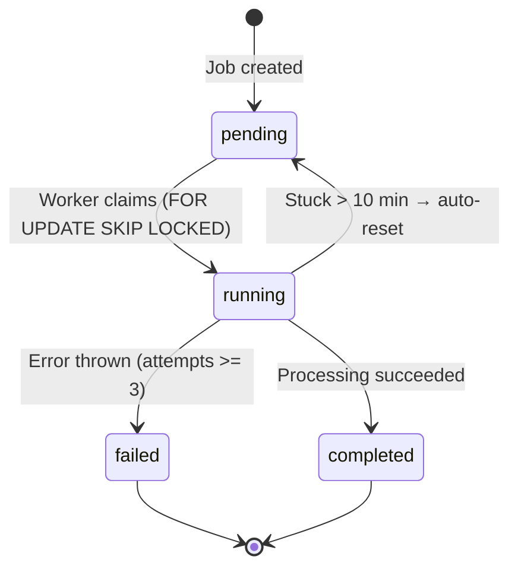

**Job types:**

| Type               | Payload                                          | Processor                               |
| ------------------ | ------------------------------------------------ | --------------------------------------- |
| `document_process` | `{ documentId }`                                 | Parse → embed → store chunks            |
| `quiz_generate`    | `{ projectId, sets, questionsPerSet, category }` | Select chunks → Groq → insert questions |

**Concurrency model:** Multiple worker instances can run safely. `FOR UPDATE SKIP LOCKED` prevents two workers from claiming the same job.

---

## 10. Role-Based Access Control Model

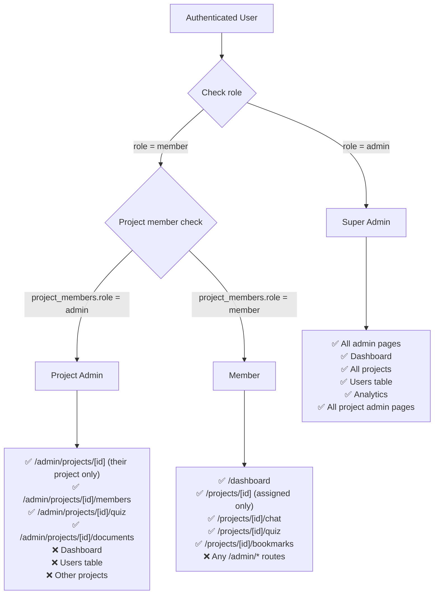

---

## 11. API Surface

### Authentication

| Method | Endpoint                    | Auth  | Description                       |
| ------ | --------------------------- | ----- | --------------------------------- |
| `POST` | `/api/auth/[...nextauth]`   | —     | NextAuth sign-in/sign-out handler |
| `POST` | `/api/auth/register`        | —     | Self-registration (rate-limited)  |
| `POST` | `/api/auth/forgot-password` | —     | Send password reset email         |
| `POST` | `/api/auth/reset-password`  | Token | Apply new password                |

### Chat

| Method | Endpoint                | Auth   | Description              |
| ------ | ----------------------- | ------ | ------------------------ |
| `GET`  | `/api/chat?sessionId=…` | Member | Fetch message history    |
| `POST` | `/api/chat`             | Member | Stream RAG chat response |

### Documents

| Method | Endpoint                           | Auth   | Description                   |
| ------ | ---------------------------------- | ------ | ----------------------------- |
| `POST` | `/api/documents/upload`            | Admin  | Upload file to storage        |
| `POST` | `/api/documents/process`           | Admin  | Queue document processing job |
| `GET`  | `/api/documents/view?documentId=…` | Member | Get signed file URL           |

### Quiz

| Method | Endpoint                | Auth   | Description            |
| ------ | ----------------------- | ------ | ---------------------- |
| `GET`  | `/api/quiz?projectId=…` | Member | Get assigned questions |
| `POST` | `/api/quiz/answer`      | Member | Save a single answer   |
| `POST` | `/api/quiz/submit`      | Member | Submit attempt         |

### Bookmarks

| Method | Endpoint                     | Auth   | Description                  |
| ------ | ---------------------------- | ------ | ---------------------------- |
| `GET`  | `/api/bookmarks?projectId=…` | Member | List bookmarks               |
| `POST` | `/api/bookmarks`             | Member | Toggle bookmark on a message |

### Admin

| Method | Endpoint                   | Auth           | Description                   |
| ------ | -------------------------- | -------------- | ----------------------------- |
| `GET`  | `/api/admin/users`         | Super Admin    | List all users                |
| `POST` | `/api/admin/invite`        | Super Admin    | Send invite email             |
| `POST` | `/api/admin/quiz/generate` | Project Admin+ | Queue quiz generation         |
| `POST` | `/api/admin/retake`        | Project Admin+ | Approve/reject retake request |

### Worker

| Method | Endpoint           | Auth                   | Description                        |
| ------ | ------------------ | ---------------------- | ---------------------------------- |
| `POST` | `/api/jobs/worker` | `WORKER_SECRET` header | Claim and process next pending job |

---

## 12. Component Hierarchy

```
app/
└── layout.tsx                     Root layout (fonts, globals)
    ├── (auth)/login/page.tsx
    │   └── LoginForm
    ├── (member)/layout.tsx
    │   ├── Navbar
    │   ├── MemberSidebar / MemberMobileSidebar
    │   └── [member pages]
    │       ├── dashboard/page.tsx
    │       │   └── ProjectCard (×N)
    │       └── projects/[id]/
    │           ├── page.tsx        (ProjectOverview + document list)
    │           ├── chat/           ChatInterface
    │           │   ├── MessageBubble (×N)
    │           │   │   └── BookmarkButton
    │           │   └── SourceTag (×N)
    │           └── quiz/           QuizExperience
    │               ├── QuestionView
    │               └── ResultSummary
    └── (admin)/layout.tsx
        ├── Navbar
        ├── AdminSidebar / AdminMobileSidebar  (filtered by isSuperAdmin)
        └── [admin pages]
            ├── admin/dashboard/page.tsx
            │   ├── StatsCard (×6)
            │   └── ActivityFeed
            ├── admin/users/page.tsx
            │   └── UsersTable
            │       ├── UserFiltersPanel
            │       ├── UserDetailDrawer
            │       └── BulkActionToolbar
            └── admin/projects/[id]/page.tsx
                ├── DocumentUploadPanel
                ├── RetakeRequestsCard
                ├── QuizSetsPanel
                └── QuizGeneratorForm
```

---

## 13. Security Model

| Concern                | Mitigation                                                                                        |
| ---------------------- | ------------------------------------------------------------------------------------------------- |
| **Password storage**   | bcrypt with cost factor 12                                                                        |
| **Session tokens**     | JWT in `httpOnly` + `Secure` + `SameSite=Lax` cookie; not accessible to JS                        |
| **Route protection**   | Server-side role guards on every page and action before data fetch                                |
| **Project isolation**  | `requireProjectAdmin(projectId)` checks both global role and per-project membership row           |
| **CSRF**               | NextAuth.js handles CSRF token validation on all form submissions                                 |
| **Rate limiting**      | In-memory rate limiter on `/api/auth/register`, `/api/auth/forgot-password`                       |
| **SQL injection**      | All queries use `postgres.js` tagged-template literals (parameterised by default)                 |
| **File upload**        | MIME type and extension allowlist; file size limit enforced server-side                           |
| **PII detection**      | Regex scan on every uploaded document before embedding — flags email, phone, SSN patterns         |
| **SSRF**               | Worker secret (`WORKER_SECRET`) validates all polling requests                                    |
| **Input sanitisation** | `lib/security.ts` sanitises free-text inputs before DB writes                                     |
| **Document access**    | Signed/gated `/api/documents/view` — members can only access documents in their assigned projects |

---

## 14. Deployment Topology

### Development

```
localhost:3000    ← Next.js dev server (npm run dev)
localhost:5433    ← PostgreSQL 13
worker process    ← node worker/index.mjs (separate terminal)
```

### Production (single server)

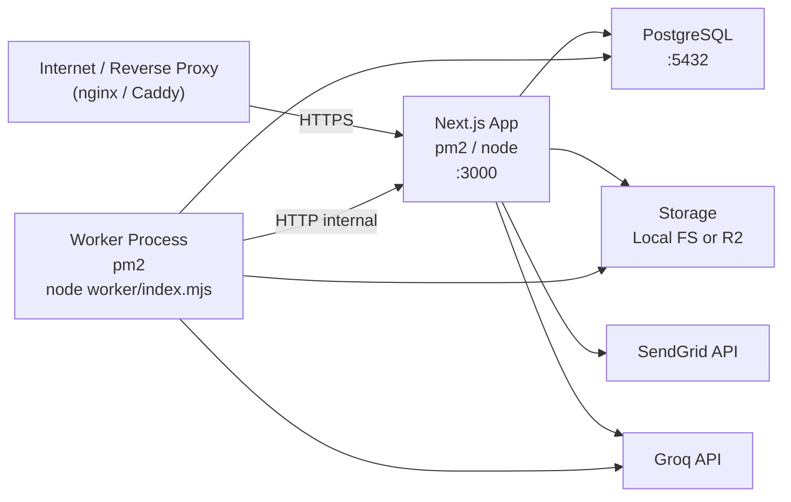

See [SELF_HOSTED_DEPLOYMENT.md](SELF_HOSTED_DEPLOYMENT.md) for full server setup, nginx config, PM2 ecosystem, and environment variable management.

---

## 1. System Overview

Summit KT Portal is a **multi-role, project-scoped knowledge-transfer platform**. It enables admins to upload KT documents, generate AI quizzes, and monitor member readiness. Members interact with a RAG-powered chatbot and complete a one-time readiness assessment.

```
┌─────────────────────────────────────────────────────────────────┐
│                        SUMMIT KT PORTAL                         │
│                                                                 │
│   ADMIN                          MEMBER                         │
│   ─────                          ──────                         │
│   • Create & manage projects     • View assigned projects       │
│   • Upload & process KT docs     • Chat with AI assistant       │
│   • Generate AI quizzes          • Take one-time readiness quiz │
│   • Invite team members          • Request quiz re-enable       │
│   • View analytics & activity    • Review quiz results          │
│   • Reset quiz attempts          • Reset own password           │
│   • Review re-enable requests                                   │
└─────────────────────────────────────────────────────────────────┘
```

---

## 2. High-Level Architecture

```
  Browser / Client
  ┌─────────────────────────────────────────────────────┐
  │  Next.js 14 App Router (React Server Components)    │
  │  ┌──────────────┐  ┌──────────────┐                 │
  │  │  Admin Pages │  │ Member Pages │                 │
  │  └──────────────┘  └──────────────┘                 │
  │         │                  │                        │
  │         └────────┬─────────┘                        │
  │                  │ Server Actions / API Routes       │
  └──────────────────┼──────────────────────────────────┘
                     │
        ┌────────────┼──────────────┬──────────────────┐
        │            │              │                  │
        ▼            ▼              ▼                  ▼
  ┌──────────┐ ┌──────────────┐ ┌──────────┐  ┌──────────────┐
  │PostgreSQL│ │  Groq Cloud  │ │  Local   │  │    Resend    │
  │(local)   │ │              │ │ Storage  │  │    (Email)   │
  │          │ │ Chat:        │ │ (Node.js │  │              │
  │ pgvector │ │ llama-3.3-  │ │ fs API)  │  │ Invite links │
  │ pgcrypto │ │ 70b-versatile│ │          │  │ Password     │
  │          │ │              │ │ File     │  │ reset email  │
  │          │ │ Quiz gen:    │ │ uploads: │  │ Quiz notifs  │
  │          │ │ llama-3.1-  │ │ /public/ │  └──────────────┘
  │          │ │ 8b-instant  │ │ uploads/ │
  └──────────┘ └──────────────┘ └──────────┘

  Auth (NextAuth.js v4)
  ┌──────────────────────────────────────┐
  │  Credentials provider (email+bcrypt) │
  │  JWT sessions · httpOnly cookie      │
  │  Session: next-auth.session-token    │
  └──────────────────────────────────────┘

  Embeddings (local, server-side)
  ┌──────────────────────────────────────┐
  │  @xenova/transformers                │
  │  Model: Xenova/all-MiniLM-L6-v2     │
  │  Dimensions: 384                     │
  │  Runs in Node.js on the server       │
  └──────────────────────────────────────┘

  Background Worker (standalone process)
  ┌──────────────────────────────────────┐
  │  worker/index.mjs                    │
  │  Polls POST /api/jobs/worker @ 1 s  │
  │  Processes document_process and      │
  │  quiz_generate jobs from queue       │
  │  Inline stuck-job reset (no pg_cron) │
  └──────────────────────────────────────┘
```

---

## 3. Application Layer Structure

```
summit-kt-portal/
│
├── app/                              ← Next.js App Router
│   ├── login/                        ← Login page
│   ├── register/                     ← Self-registration page
│   ├── forgot-password/              ← Password reset request page
│   ├── auth/
│   │   ├── reset-password/           ← Set new password (token link)
│   │   └── accept-invite/            ← Admin invite acceptance page
│   │
│   ├── (admin)/                      ← Role-guarded admin routes
│   │   └── admin/
│   │       ├── dashboard/            ← Global stats + retake request alert
│   │       ├── projects/             ← Project list with pending-request badges
│   │       └── projects/[id]/
│   │           ├── page.tsx          ← Project overview + retake requests card
│   │           ├── documents/        ← Upload & process KT docs
│   │           ├── members/          ← Invite & manage members
│   │           ├── chat/             ← Admin can preview chatbot
│   │           ├── quiz/             ← Generate & manage quiz sets
│   │           └── analytics/        ← Per-project analytics
│   │
│   ├── (member)/                     ← Role-guarded member routes
│   │   ├── dashboard/                ← Assigned projects list
│   │   └── projects/[id]/
│   │       ├── page.tsx              ← Project overview
│   │       ├── chat/                 ← RAG chat interface
│   │       └── quiz/                 ← One-time quiz + retake request button
│   │
│   └── api/
│       ├── auth/
│       │   ├── [...nextauth]/        ← NextAuth.js route handler
│       │   ├── register/             ← POST self-registration
│       │   ├── forgot-password/      ← POST send reset email
│       │   └── reset-password/       ← POST apply new password
│       ├── chat/                     ← GET history | POST streaming chat
│       ├── documents/
│       │   ├── upload/               ← POST upload to Cloudflare R2
│       │   ├── process/              ← POST queue document_process job
│       │   └── view/                 ← GET signed URL for doc preview
│       ├── quiz/
│       │   ├── generate/             ← POST queue quiz_generate job
│       │   ├── start/                ← POST begin quiz attempt
│       │   ├── submit/               ← POST submit answers + score
│       │   └── request-retake/       ← POST member requests re-enable
│       ├── jobs/
│       │   ├── worker/               ← POST claim + execute next pending job
│       │   └── [id]/                 ← GET job status for polling
│       └── admin/
│           ├── analytics/            ← GET project analytics
│           └── invite/               ← POST invite member by email
│
├── components/
│   ├── admin/                        ← Admin-only UI components
│   │   └── retake-requests-card.tsx  ← Approve/reject re-enable requests
│   ├── auth/                         ← Auth form components
│   │   ├── login-form.tsx
│   │   ├── register-form.tsx
│   │   ├── forgot-password-form.tsx
│   │   └── reset-password-form.tsx
│   ├── chat/                         ← Chat interface components
│   ├── layout/                       ← Sidebars, navbar, project card
│   ├── quiz/
│   │   ├── quiz-experience.tsx       ← Full quiz flow (start→answer→result)
│   │   └── retake-request-button.tsx ← Member re-enable request UI
│   └── ui/                           ← Base UI primitives (shadcn-style)
│
├── lib/
│   ├── auth.ts                       ← NextAuth session helpers, role guards
│   ├── data.ts                       ← All DB query functions
│   ├── db.ts                         ← postgres.js tagged-template client
│   ├── email.ts                      ← Resend email templates
│   ├── env.ts                        ← Env var validation
│   ├── rate-limit.ts                 ← Activity-log-based rate limiting
│   ├── security.ts                   ← Origin validation helper
│   ├── utils.ts                      ← Formatting utilities
│   ├── documents/
│   │   ├── parse.ts                  ← PDF / DOCX / CSV text extraction
│   │   ├── process.ts                ← Chunk + embed + upsert pipeline
│   │   └── upload.ts                 ← Local file upload helper
│   ├── groq/
│   │   ├── chat.ts                   ← Groq client, retry, model selection
│   │   └── streaming.ts              ← Stream token consumer
│   ├── rag/
│   │   ├── chunking.ts               ← Sliding-window text chunker
│   │   ├── embeddings.ts             ← @xenova transformer pipeline
│   │   └── retrieval.ts              ← pgvector similarity search
│   ├── quiz/
│   │   ├── assignment.ts             ← Quiz question assignment logic
│   │   ├── scoring.ts                ← Score calculation
│   │   └── shuffle.ts                ← Question/option shuffling
│   ├── storage/
│   │   └── local.ts                  ← Local file system storage (Node.js fs)
│   └── types/
│       └── database.ts               ← Shared TypeScript types
│
├── worker/
│   └── index.mjs                     ← Standalone background worker process
│
├── postgres/
│   ├── schema.sql                    ← Full DB schema (run once)
│   └── migrations/
│       ├── add_password_reset_tokens.sql
│       └── add_quiz_retake_requests.sql
│
├── auth.ts                           ← NextAuth configuration
└── middleware.ts                     ← Global route guard (NextAuth-based)
```

---

## 4. Data Architecture

### Entity-Relationship Diagram

```
  public.users
  ┌──────────────────────────────┐
  │ id (PK, uuid)                │
  │ email                        │
  │ full_name                    │
  │ role: admin | member         │
  │ password_hash (bcrypt)       │
  │ is_active                    │
  │ last_login_at                │
  │ created_at                   │
  └──────┬───────────────────────┘
         │                    │
         │ created_by         │ user_id
         ▼                    ▼
  public.projects       public.project_members
  ┌───────────────┐     ┌───────────────────────┐
  │ id (PK)       │◄────│ project_id (FK)        │
  │ name          │     │ user_id (FK)           │
  │ description   │     │ assigned_at            │
  │ is_active     │     └───────────────────────┘
  │ pass_threshold│
  │ quiz_open_at  │
  │ quiz_close_at │
  │ created_by    │
  └───┬───────────┘
      │
      ├──────────────────────────────────────────┐
      │                                          │
      ▼                                          ▼
  public.documents                         public.chat_sessions
  ┌────────────────────────┐               ┌──────────────────────┐
  │ id (PK)                │               │ id (PK)              │
  │ project_id (FK)        │               │ user_id (FK)         │
  │ file_name              │               │ project_id (FK)      │
  │ file_url (R2 key)      │               │ started_at           │
  │ file_type              │               │ message_count        │
  │ chunk_count            │               │ last_message_at      │
  │ uploaded_by (FK)       │               └──────────┬───────────┘
  └────────┬───────────────┘                          │
           │                                          ▼
           ▼                                  public.chat_messages
  public.document_chunks                     ┌──────────────────────┐
  ┌────────────────────────┐                 │ id (PK)              │
  │ id (PK)                │                 │ session_id (FK)      │
  │ document_id (FK)       │                 │ role: user|assistant │
  │ project_id (FK)        │                 │ content              │
  │ content                │                 │ sources (JSONB)      │
  │ embedding: vector(384) │                 │ created_at           │
  │ chunk_index            │                 └──────────────────────┘
  └────────────────────────┘

      │ (project_id)
      ▼
  public.quiz_sets
  ┌────────────────────────┐
  │ id (PK)                │
  │ project_id (FK)        │
  │ set_name               │
  │ set_number             │
  │ category               │  ← 'functional' | 'technical'
  │ is_active              │
  └────────┬───────────────┘
           │
           ▼
  public.quiz_questions
  ┌────────────────────────────┐
  │ id (PK)                    │
  │ quiz_set_id (FK)           │
  │ question_text              │
  │ question_type: mcq|true_false │
  │ option_a/b/c/d             │
  │ correct_option: A|B|C|D   │
  │ explanation                │
  │ marks: 1 | 2 | 3          │
  └────────────────────────────┘

  public.quiz_attempts
  ┌────────────────────────────────┐
  │ id (PK)                        │
  │ user_id (FK)                   │
  │ project_id (FK)                │
  │ quiz_set_id (FK)               │
  │ assigned_questions (JSONB)     │
  │ answers_given (JSONB)          │
  │ score / total_marks / %        │
  │ passed                         │
  │ status: in_progress|submitted  │
  │ started_at / submitted_at      │
  │ carried_sections (JSONB)       │
  └────────────────────────────────┘

  public.quiz_retake_requests       ← Member re-enable requests
  ┌────────────────────────────┐
  │ id (PK)                    │
  │ user_id (FK → users)       │
  │ project_id (FK → projects) │
  │ attempt_id (uuid, nullable)│
  │ reason (text)              │
  │ status: pending|approved   │
  │         |rejected          │
  │ created_at                 │
  │ resolved_at                │
  │ resolved_by (FK → users)   │
  └────────────────────────────┘

  public.quiz_resets
  ┌────────────────────────┐
  │ id (PK)                │
  │ user_id (FK)           │
  │ project_id (FK)        │
  │ reset_by (FK → users)  │
  │ reason                 │
  │ reset_at               │
  └────────────────────────┘

  public.processing_jobs                    ← Background job queue
  ┌──────────────────────────────────────┐
  │ id (PK, uuid)                        │
  │ type: document_process|quiz_generate │
  │ status: pending|running|done|failed  │
  │ payload (JSONB)                      │
  │ result (JSONB)                       │
  │ error (text)                         │
  │ created_at / started_at / completed_at│
  └──────────────────────────────────────┘

  public.invite_tokens                      ← Admin invite flow
  ┌────────────────────────┐
  │ id (PK)                │
  │ email                  │
  │ token (unique)         │
  │ role                   │
  │ project_id (nullable)  │
  │ expires_at             │
  │ created_at             │
  └────────────────────────┘

  public.password_reset_tokens              ← Forgot-password flow
  ┌────────────────────────┐
  │ id (PK)                │
  │ email                  │
  │ token (unique)         │
  │ expires_at (1 hour)    │
  │ created_at             │
  └────────────────────────┘

  public.activity_log
  ┌────────────────────────┐
  │ id (PK)                │
  │ user_id (FK)           │
  │ project_id (FK)        │
  │ action                 │
  │ metadata (JSONB)       │
  │ created_at             │
  └────────────────────────┘
```

### Access Control Summary

No Row Level Security (RLS). All access control is enforced at the application layer.

| Table                 | Member Access              | Admin Access |
| --------------------- | -------------------------- | ------------ |
| users                 | Own row only               | Full         |
| projects              | Assigned projects only     | Full         |
| project_members       | Own memberships            | Full         |
| documents             | Assigned project docs      | Full         |
| document_chunks       | Assigned project chunks    | Full         |
| chat_sessions         | Own sessions               | Full         |
| chat_messages         | Own session messages       | Full         |
| quiz_sets             | Assigned projects          | Full         |
| quiz_questions        | Assigned projects          | Full         |
| quiz_attempts         | Own attempts               | Full         |
| quiz_retake_requests  | Own requests (create only) | Full         |
| quiz_resets           | —                          | Full         |
| invite_tokens         | —                          | Full         |
| password_reset_tokens | Own (via token link)       | —            |
| processing_jobs       | —                          | Full         |
| activity_log          | Own actions                | Full         |

---

## 5. Core Feature Flows

### 5.1 Authentication & Authorization

```
  User visits protected route
          │
          ▼
  middleware.ts (NextAuth-based)
  ┌────────────────────────────────────────────────┐
  │ Read next-auth.session-token cookie            │
  │ Public routes?  → pass through                 │
  │ /admin/* ?      → require role = 'admin'       │
  │ /dashboard/* ?  → require role = 'member'      │
  │ No session?     → redirect → /login            │
  │ Wrong role?     → redirect → correct dashboard │
  └────────────────────────────────────────────────┘
          │
          ▼
  Page Server Component
  requireAdmin() | requireMember()  ← lib/auth.ts
  Calls auth() from NextAuth, fetches profile from DB
  Returns { userId, user, profile } or redirects

  Login flow:
  POST credentials → NextAuth authorize() → bcrypt.compare()
  → JWT issued → session cookie set

  Forgot-password flow:
  POST /api/auth/forgot-password
  → generate crypto token → insert password_reset_tokens
  → send Resend email with /auth/reset-password?token=...
  POST /api/auth/reset-password
  → validate token not expired → bcrypt.hash → UPDATE users
  → DELETE token

  Invite flow (admin → member):
  POST /api/admin/invite
  → generate token → insert invite_tokens → send Resend email
  GET /auth/accept-invite?token=...
  → validate token → member sets name + password
  POST /api/auth/accept-invite
  → bcrypt.hash → INSERT users → DELETE token
```

### 5.2 Document Ingestion Pipeline (RAG)

```
  Admin uploads file
          │
          ▼
  POST /api/documents/upload
  ┌──────────────────────────────────────────┐
  │ 1. Validate file type (PDF/DOCX/CSV/TXT) │
  │ 2. Upload to local storage (Node.js fs)  │
  │    → /public/uploads/[timestamp]-name    │
  │ 3. Insert record in documents table      │
  │    (file_url = "uploads/...")            │
  └──────────────────────────────────────────┘
          │
          ▼
  Admin clicks "Process" button
          │
          ▼
  POST /api/documents/process
  ┌──────────────────────────────────────────────────────┐
  │ 1. Auth + admin check                                │
  │ 2. INSERT processing_jobs                            │
  │    { type: 'document_process',                       │
  │      payload: { documentId, projectId } }            │
  │ 3. Fire-and-forget POST /api/jobs/worker             │
  │ 4. Return { jobId } immediately (< 100 ms)           │
  └──────────────────────────────────────────────────────┘
          │
          │  Frontend polls GET /api/jobs/[id] every 3 s
          │
          ▼
  Background worker picks up job (within 1 s)
  POST /api/jobs/worker (internal)
  ┌──────────────────────────────────────────────────────┐
  │ 1. Download file from local storage (readFileSync)   │
  │ 2. Extract text                                      │
  │    ├── PDF    → pdf-parse                            │
  │    ├── DOCX   → mammoth                              │
  │    ├── CSV    → csv-parse                            │
  │    └── TXT    → raw buffer                           │
  │ 3. Chunk text (sliding window)                       │
  │    ├── chunk_size = 500 tokens (words)               │
  │    └── overlap = 50 tokens                           │
  │ 4. For each chunk:                                   │
  │    ├── embedText() via @xenova/all-MiniLM-L6-v2     │
  │    └── Upsert into document_chunks (vector 384)      │
  │ 5. Update documents.chunk_count                      │
  │ 6. Mark job status = 'done', result = { chunkCount } │
  └──────────────────────────────────────────────────────┘
          │
          ▼
  Frontend poll detects status='done' → shows "Ready"

  Security note: All files are stored locally; no external
  cloud APIs are called. Access control enforced via auth.
```

### 5.3 AI-Grounded Chat (RAG)

```
  Member types a question
          │
          ▼
  POST /api/chat
  ┌──────────────────────────────────────────────────────────────┐
  │ 1. Auth check + rate limit (30 msg / hour)                   │
  │ 2. Project access check                                      │
  │ 3. embedText(question) → 384-dim vector                      │
  │ 4. match_document_chunks() pgvector cosine similarity        │
  │    └── Returns top-5 chunks for the project                  │
  │ 5. Build system prompt                                       │
  │    "Answer ONLY from this context: [chunks]"                 │
  │ 6. Check in-memory answer cache (projectId + message key)    │
  │    ├── Cache HIT  → return cached response immediately       │
  │    └── Cache MISS → call Groq                                │
  │ 7. Groq streaming completion                                 │
  │    ├── Primary: llama-3.3-70b-versatile                      │
  │    └── Fallback: llama-3.1-8b-instant (on rate limit/error)  │
  │ 8. Stream tokens to client via ReadableStream                │
  │ 9. Persist user + assistant messages in chat_messages        │
  │    (sources stored as JSONB via sql.json())                  │
  │ 10. Log activity                                             │
  └──────────────────────────────────────────────────────────────┘
          │
          ▼
  Client receives streamed tokens
  Sources displayed as tags below response
```

### 5.4 Quiz Generation & Delivery

```
  ┌─────────────────────────────────────────────────┐
  │           ADMIN: QUIZ GENERATION                │
  │                                                 │
  │  Configure: category (functional|technical)     │
  │             numSets (1–5)                       │
  │                                                 │
  │  POST /api/quiz/generate                        │
  │  1. Auth + admin check                          │
  │  2. Fail-fast: verify document chunks exist     │
  │  3. INSERT processing_jobs                      │
  │     { type: 'quiz_generate',                    │
  │       payload: { projectId, category, numSets }}│
  │  4. Fire-and-forget POST /api/jobs/worker       │
  │  5. Return { jobId } immediately                │
  │                                                 │
  │  Background worker picks up job within 1 s:     │
  │  1. Fetch up to 30 document_chunks              │
  │  2. Shuffle chunks (diversity)                  │
  │  3. Split into N groups (one per set)           │
  │  4. For each set (sleep 3 s between sets):      │
  │     ├── Build context (chunks × 300 chars max)  │
  │     ├── Call Groq llama-3.1-8b-instant          │
  │     │   (131K TPM — handles multi-set jobs)     │
  │     ├── Parse JSON response (10 questions/set)  │
  │     └── Insert quiz_set + quiz_questions        │
  │  5. Mark job done, result = { createdSets, ... }│
  │                                                 │
  │  Frontend polls → shows success banner          │
  └─────────────────────────────────────────────────┘

  ┌─────────────────────────────────────────────────┐
  │          MEMBER: QUIZ EXPERIENCE                │
  │                                                 │
  │  POST /api/quiz/start                           │
  │  1. Check quiz window (open_at / close_at)      │
  │  2. Check no submitted attempt exists           │
  │  3. Assign questions from active quiz_set       │
  │     ├── Functional set  → N questions           │
  │     ├── Technical set   → N questions           │
  │     └── Shuffle options (Fisher-Yates)          │
  │  4. Create quiz_attempt (status=in_progress)    │
  │                                                 │
  │  Anti-cheat guard (client-side):                │
  │  Tab/window visibility change detected          │
  │  → quiz auto-submitted immediately              │
  │                                                 │
  │  Member answers questions one-by-one            │
  │                                                 │
  │  POST /api/quiz/submit                          │
  │  1. Validate attempt ownership + status         │
  │  2. Calculate score (correct × marks)           │
  │  3. Compute percentage, passed (≥ threshold%)   │
  │  4. Update attempt (status=submitted)           │
  │  5. Send email notification via Resend          │
  │  6. Log activity                                │
  └─────────────────────────────────────────────────┘
```

### 5.5 Quiz Re-enable Request Flow

```
  Member's quiz auto-submitted (tab switch)
          │
          ▼
  Result screen shows score + "Request re-enable" button
          │
          ▼
  Member optionally fills reason → clicks Submit
          │
          ▼
  POST /api/quiz/request-retake
  ┌──────────────────────────────────────────────────────┐
  │ 1. Verify submitted attempt exists                   │
  │ 2. Check no duplicate pending request               │
  │ 3. INSERT quiz_retake_requests (status='pending')   │
  └──────────────────────────────────────────────────────┘
          │
          ▼
  Admin sees notification in two places:
  ┌──────────────────────────────────────────────────────┐
  │  Admin dashboard:                                    │
  │  "Quiz re-enable requests" StatsCard shows count     │
  │  → Clickable when count > 0, links to /admin/projects│
  │                                                      │
  │  Projects list:                                      │
  │  Project card gets amber ring + "N re-enable         │
  │  requests" badge → "Open" button changes to "Review" │
  └──────────────────────────────────────────────────────┘
          │
          ▼
  Admin opens project detail page
  → RetakeRequestsCard shows pending requests
  → Admin clicks Approve or Reject
          │
  ┌───────┴──────────┐
  ▼                  ▼
Approve            Reject
  │                  │
  ▼                  ▼
DELETE quiz_attempt  UPDATE status='rejected'
UPDATE status=       resolved_at=NOW()
  'approved'         resolved_by=adminId
resolved_at=NOW()
resolved_by=adminId
  │
  ▼
Member can now retake
quiz from scratch
```

### 5.6 Background Job Queue

```
  Admin action (process doc / generate quiz)
          │
          ▼
  API route inserts row into processing_jobs
  { status: 'pending', type, payload }
  + fire-and-forget POST /api/jobs/worker
          │
          │  Returns jobId to client immediately
          │
          ▼
  Standalone worker (worker/index.mjs)
  polls POST /api/jobs/worker every 1 second
          │
          ▼
  /api/jobs/worker
  ┌──────────────────────────────────────────────┐
  │ 0. Reset stuck jobs (> 10 min in 'running')  │
  │    → back to 'pending' for retry             │
  │ 1. Auth: x-worker-secret header check        │
  │ 2. claim_next_pending_job() function         │
  │    SELECT ... FOR UPDATE SKIP LOCKED         │
  │    → atomically sets status='running'        │
  │ 3. Route by job.type:                        │
  │    document_process → processDocumentJob()   │
  │    quiz_generate    → processQuizGenerateJob()│
  │ 4. On success: status='done', result=...     │
  │    On failure: status='failed', error=...    │
  └──────────────────────────────────────────────┘
          │
          ▼
  Frontend polls GET /api/jobs/[id] every 3 s
  until status = 'done' | 'failed'

  Note: pg_cron is NOT used. Stuck-job reset runs
  inline at the start of every worker poll cycle.
```

---

## 6. Component Hierarchy

```
app/layout.tsx
└── (role-specific layout)
    ├── AdminLayout
    │   ├── AdminSidebar / AdminMobileSidebar
    │   │   ├── Project navigation links
    │   │   └── LogoutButton
    │   └── [page content]
    │       ├── AdminDashboardPage
    │       │   ├── StatsCard ×6 (incl. retake requests)
    │       │   └── ActivityFeed
    │       ├── AdminProjectsPage
    │       │   └── ProjectCard ×N (amber badge if pending retakes)
    │       └── AdminProjectDetailPage
    │           ├── DocumentUploadPanel
    │           │   └── (upload → job queue → poll → done)
    │           ├── RetakeRequestsCard (if requests exist)
    │           │   └── RequestRow × N (Approve / Reject)
    │           ├── MembersPage
    │           │   └── InviteForm
    │           ├── QuizPage
    │           │   ├── QuizGenerator (queue + poll job)
    │           │   ├── QuizWindowForm (schedule)
    │           │   ├── QuizSetsPanel (list sets)
    │           │   └── QuizResultsCard (per-member)
    │           ├── AnalyticsPage
    │           │   └── AnalyticsTable ×3
    │           └── ChatPage
    │               └── ChatInterface
    │                   ├── MessageBubble ×N
    │                   └── SourceTag ×N
    │
    └── MemberLayout
        ├── MemberSidebar / MemberMobileSidebar
        └── [page content]
            ├── MemberDashboardPage
            │   └── ProjectCard ×N
            ├── MemberProjectDetailPage
            │   └── SetupPanel / overview
            ├── ChatPage
            │   └── ChatInterface
            └── QuizPage
                └── QuizExperience
                    ├── QuizCard (pre-start)
                    ├── QuestionView ×N
                    ├── ResultSummary
                    └── RetakeRequestButton (if submitted)
```

---

## 7. API Surface

| Method   | Endpoint                          | Auth           | Description                                      |
| -------- | --------------------------------- | -------------- | ------------------------------------------------ |
| GET      | `/api/chat?sessionId=`            | Member/Admin   | Load chat history for a session                  |
| POST     | `/api/chat`                       | Member/Admin   | Send message, get streaming response             |
| POST     | `/api/documents/upload`           | Admin          | Upload file to local storage (`public/uploads/`) |
| POST     | `/api/documents/process`          | Admin          | Queue document_process job; returns `{ jobId }`  |
| GET      | `/api/documents/view?documentId=` | Member/Admin   | Stream document from local storage               |
| POST     | `/api/quiz/generate`              | Admin          | Queue quiz_generate job; returns `{ jobId }`     |
| POST     | `/api/quiz/start`                 | Member         | Begin quiz attempt                               |
| POST     | `/api/quiz/submit`                | Member         | Submit answers and receive score                 |
| POST     | `/api/quiz/request-retake`        | Member         | Request admin to re-enable quiz                  |
| POST     | `/api/jobs/worker`                | Worker secret  | Claim and execute next pending job               |
| GET      | `/api/jobs/[id]`                  | Authenticated  | Poll job status (`pending/running/done/failed`)  |
| GET      | `/api/admin/analytics?projectId=` | Admin          | Per-project chatbot + quiz + login analytics     |
| POST     | `/api/admin/invite`               | Admin          | Invite member by email (token-based)             |
| POST     | `/api/auth/register`              | Public         | Self-register as member                          |
| POST     | `/api/auth/forgot-password`       | Public         | Send password reset email                        |
| POST     | `/api/auth/reset-password`        | Public (token) | Apply new password from reset link               |
| GET/POST | `/api/auth/[...nextauth]`         | Public         | NextAuth.js session handler                      |

---

## 8. Security Model

```
  ┌────────────────────────────────────────────────┐
  │                 SECURITY LAYERS                │
  │                                                │
  │  1. NextAuth.js JWT (httpOnly cookie)          │
  │     └── Session verified on every server      │
  │         component and API route call           │
  │                                                │
  │  2. Middleware Route Guards                    │
  │     ├── /admin/* → role must be 'admin'        │
  │     └── /dashboard,/projects → role='member'  │
  │                                                │
  │  3. API Route Auth Checks                      │
  │     ├── getCurrentUserContext() on every req   │
  │     ├── profile.role check per endpoint        │
  │     └── userHasProjectAccess() for members     │
  │                                                │
  │  4. Application-Level Access Control           │
  │     (replaces Supabase RLS)                    │
  │     └── All SQL queries scoped by userId or    │
  │         projectId verified against session     │
  │                                                │
  │  5. Rate Limiting                              │
  │     └── 30 chat messages / hour / user         │
  │         (enforced via activity_log count)      │
  │                                                │
  │  6. Origin Validation                          │
  │     └── validateOrigin() on mutation routes   │
  │         (checks Host / Origin headers)         │
  │                                                │
  │  7. Worker Route Authentication                │
  │     └── x-worker-secret header must match      │
  │         WORKER_SECRET env var when set         │
  │                                                │
  │  8. Password Security                          │
  │     └── bcrypt (cost factor 12) for all        │
  │         stored passwords; reset tokens are     │
  │         cryptographically random, 1-hour TTL   │
  └────────────────────────────────────────────────┘
```

---

## 9. Known Gaps

| #   | Area                            | Gap                                                                                                     | Impact                                             |
| --- | ------------------------------- | ------------------------------------------------------------------------------------------------------- | -------------------------------------------------- |
| 1   | **Answer Cache**                | In-memory `Map` is per-process and lost on restart; shared cache (Redis/KV) not implemented             | Cache is useless in multi-instance deployments     |
| 2   | **Embedding Cold Start**        | `@xenova/transformers` model downloads on first request (~80MB); no warmup                              | First chat per cold start can take 30–60s          |
| 3   | **Quiz Anti-Cheat**             | Tab-switch detection triggers auto-submit but copy-paste and screen-share prevention are not enforced   | Quiz integrity not fully guaranteed                |
| 4   | **Email Required for Reset**    | Forgot-password and invite flows require `RESEND_API_KEY`; silently skipped if unset                    | Users cannot recover accounts without email config |
| 5   | **Admin Bootstrap**             | No seeding UI; first admin must be promoted manually via SQL                                            | Manual DB step required after first signup         |
| 6   | **Document Backup**             | Local storage requires manual backup strategy; no automatic replication                                 | Data loss possible if disk fails                   |
| 7   | **Pagination**                  | All data fetches are unbounded                                                                          | Performance degrades at scale                      |
| 8   | **File Validation**             | No server-side MIME type check beyond extension                                                         | Malicious files can be uploaded                    |
| 9   | **File Size Limit**             | No size cap on upload endpoint                                                                          | Storage exhaustion possible                        |
| 10  | **Retake Request Notification** | No real-time push (email/webhook) to admin when a retake request is created; admin must check dashboard | Requests may go unnoticed until admin logs in      |

---

## 10. Good-to-Have Features

### 10.1 Knowledge & Learning

| Feature                   | Description                                                        |
| ------------------------- | ------------------------------------------------------------------ |
| **Conversation history**  | Multi-session history panel; members can resume previous chats     |
| **Chat bookmarks**        | Members can save important AI answers for later reference          |
| **Knowledge gap reports** | Analyse questions with no matching chunks (low-similarity results) |
| **Document versioning**   | Track revisions; re-process on update; keep old chunks for history |

### 10.2 Quiz & Assessment

| Feature                       | Description                                                   |
| ----------------------------- | ------------------------------------------------------------- |
| **Timed quiz mode**           | Configurable per-question or total time limits with countdown |
| **Manual question editing**   | Admin can edit/delete individual AI-generated questions       |
| **Multiple quiz categories**  | Support categories beyond functional/technical                |
| **Partial quiz retake**       | Retake only failed sections rather than full reset            |
| **Certificate of completion** | Auto-generate PDF certificate when a member passes            |

### 10.3 Analytics & Reporting

| Feature                      | Description                                               |
| ---------------------------- | --------------------------------------------------------- |
| **Exportable reports**       | CSV/PDF export of quiz results and chatbot usage          |
| **Per-question analytics**   | Track which questions are most frequently wrong           |
| **Completion dashboard**     | Visual progress bars per project                          |
| **Score trend over resets**  | Chart score improvement across multiple attempts          |
| **Retake request analytics** | Track approval rate, most common reasons, time-to-resolve |

### 10.4 Infrastructure

| Feature                            | Description                                                               |
| ---------------------------------- | ------------------------------------------------------------------------- |
| **Shared embedding cache**         | Replace in-process singleton with persistent cache or external API        |
| **Test suite**                     | Unit tests for scoring, chunking, shuffling; integration tests for routes |
| **Real-time retake notifications** | Email admin when a re-enable request is submitted                         |
| **SSO / SAML integration**         | Enterprise SSO via OAuth providers (Okta, Azure AD)                       |
